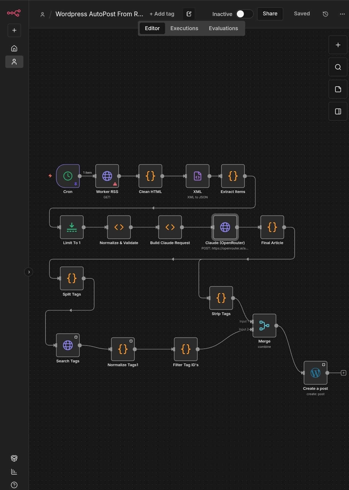

# 🧠 AI-Powered WordPress Auto-Publisher (n8n Workflow)
### Built by **Clifford’s Webhole** for *Open Source Community*

This repository contains a complete n8n workflow that automatically:
- Pulls topic-specific news
- Processes the text using AI (Claude via OpenRouter)
- Analyzes + filters content based on custom logic
- Assigns WordPress categories
- Publishes formatted posts directly to WordPress

Built from scratch a fully automated media platform created by **Clifford’s Webhole**, this workflow can be reused for *any* niche.

---

## ✨ Features

- Automated content sourcing  
- AI summarization, rewriting, and tagging  
- Category detection  
- WordPress REST publishing  
- Works with any WordPress site  
- Fully modular and beginner-friendly

---

## 📦 Requirements

Before running the workflow, you’ll need:

### ✔️ OpenRouter API key  
Used to access Claude-3.5-Sonnet or any other model.

### ✔️ WordPress REST API credentials  
(Username + Application Password)

### ✔️ n8n instance  
Docker, cloud, or local install.

---

## 🧰 Included Files

| File | Description |
|------|-------------|
| `workflow.json` | The complete n8n workflow. Import directly into n8n. |
| `screenshots/overview.png` | The n8n flow nodes screenshot.
| `LICENSE` | MIT license granting free reuse. |

---

## 📥 Installation & Usage

### 1. Import Workflow  
Go to:  
**n8n → Workflows → Import from File**  
Select `workflow.json`.

### 2. Add Credentials
- Add your **OpenRouter API Key**
- Add your **WordPress credentials**
- Replace URL fields with your domain

### 3. Review AI Prompt (Optional)  
Located inside the AI/HTTP node that calls OpenRouter.

### 4. Test the workflow  
Use **Execute Workflow** in n8n.

### 5. Schedule it  
Add a Cron node (daily/hourly) depending on your needs.

---

## 🧩 Customization

You can modify:
- Target keywords  
- Output formatting  
- WordPress post type  
- AI model  
- Tagging logic

Make it your own — the workflow is built to grow.

---

## 👨‍💻 About the Author

**Created by Clifford’s Webhole**  
Developer • Linux Admin • AI Systems Builder

Learn more about Clifford’s work at:  
**https://cliffordswebhole.com**

---

## 📝 License

This project is released under the **MIT License** (see `LICENSE` file).  
You are free to use, modify, and share it — just credit Clifford’s Webhole.
